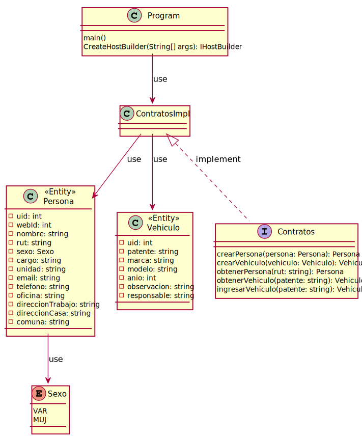

# Parking UCN

  Registration and control of vehicular access to UCN.

  **UCN  -  .NET Core -  Android Studio  -  Laravel  -  Intellij**


## Description
  Registration and control of vehicular access to the premises of the Universidad Católica del Norte.
 

##  Status
  In full development.  


##  Technologies
  - Java 1.8.0_251
  - PHP 7.4.7
  - C# 8
  - .NET Core 3.1
  - Laravel 7.18.0
  - Bootstrap 4.5
  - Intellij Idea 2020.1.2
  - Android Studio 4.2 Cannary 3
  - HTML, CSS, Javascript
  
   
##  Contact
  Created by engineering students:
  - [Pablo Castillo](https://github.com/Pablo-Castillo)	-	<pablo.castillo01@alumnos.ucn.cl>
  - [Charlie Condorcet](https://github.com/charliecondorcet)	-	<ccm059@alumnos.ucn.cl>
  - [Jorge Pizarro](https://github.com/JorgePT93)	-	<jorge.pizarro93@gmail.com>

  
## Class Diagram
  


<details><summary>PlantUML</summary>
<p>

```
@startuml

    class Persona <<Entity>> {
        - uid: int
        - webId: int
        - nombre: string
        - rut: string
        - sexo: Sexo
        - cargo: string
        - unidad: string
        - email: string
        - telefono: string
        - oficina: string
        - direccionTrabajo: string
        - direccionCasa: string
        - comuna: string
    }

    enum Sexo {
        VAR
        MUJ
    }
    Persona --> Sexo: use

    class Program {
        main()
        CreateHostBuilder(String[] args): IHostBuilder
    }

    class ContratosImpl{        
    }
    Program --> ContratosImpl: use    

    class Vehiculo <<Entity>> {
        - uid: int
        - patente: string
        - marca: string
        - modelo: string
        - anio: int
        - observacion: string
        - responsable: string
    }

    interface Contratos{
        crearPersona(persona: Persona): Persona
        crearVehiculo(vehiculo: Vehiculo): Vehiculo
        obtenerPersona(rut: string): Persona
        obtenerVehiculo(patente: string): Vehiculo
        ingresarVehiculo(patente: string): Vehiculo
    }
    ContratosImpl <|.. Contratos: implement
    ContratosImpl --> Vehiculo: use
    ContratosImpl --> Persona: use

    

@enduml
```

</p>
</details>

  
##  License
  This project is open-sourced software licensed under the [Apache License 2.0](https://www.apache.org/licenses/LICENSE-2.0)
