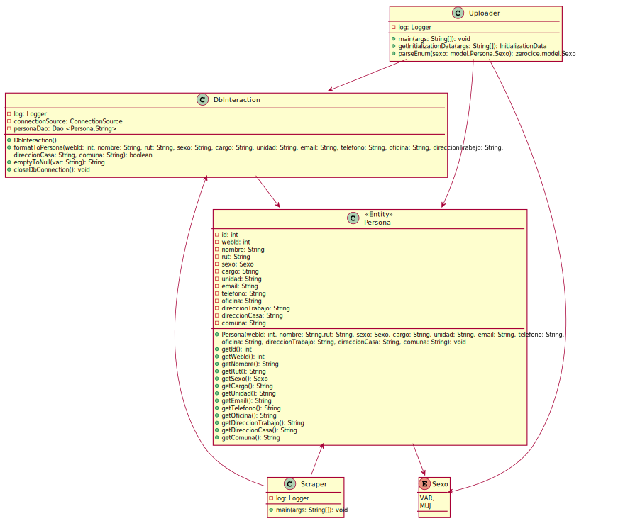

# Proyecto Parking: Scraper

## Description
  Scraper that gets information from DirectorioUCN and Nombrerutyfirma

## Java Libraries

* SLF4J: [org.slf4j:slf4j-api](https://mvnrepository.com/artifact/org.slf4j/slf4j-api)
* Logback: [ch.qos.logback:logback-classic](https://mvnrepository.com/artifact/ch.qos.logback/logback-classic)
* Jsoup: [org.jsoup:jsoup](https://mvnrepository.com/artifact/org.jsoup/jsoup)
* ORMLite: [com.j256.ormlite:ormlite](https://mvnrepository.com/artifact/com.j256.ormlite/ormlite-android)
* Xerial: [org.xerial:sqlite](https://mvnrepository.com/artifact/org.xerial/sqlite-jdbc)
* H2 Database: [com.h2database:h2](https://mvnrepository.com/artifact/com.h2database/h2)

##  Contact
  Created by engineering students:
  - [Pablo Castillo](https://github.com/Pablo-Castillo)	-	<pablo.castillo01@alumnos.ucn.cl>
  - [Charlie Condorcet](https://github.com/charliecondorcet)	-	<ccm059@alumnos.ucn.cl>
  - [Jorge Pizarro](https://github.com/JorgePT93)	-	<jorge.pizarro93@gmail.com>
  
  
##  License
  This project is open-sourced software licensed under the [Apache License 2.0](https://www.apache.org/licenses/LICENSE-2.0)

##Class Diagram



<details><summary>PlantUML</summary>
<p>

```
@startuml

class Scraper {
    -log: Logger
    {static} - docDirectoryUcn: String
    {static} - docNomRutFirm: String
    +Main()
}

class DbInteraction{

    -log: Logger
    -connectionSource: ConnectionSource
    -personaDao: Dao <Persona,String>
    
    +DbInteraction()
    +formatToPersona(webId: int, nombre: String, rut: String, sexo: String, cargo: String, unidad: String, email: String, telefono: String, oficina: String, direccionTrabajo: String,
    direccionCasa: String, comuna: String): boolean
    +emptyToNull(var: String): String
    +closeDbConnection(): void
}
class Persona <<Entity>>{
    -webId: String
    -nombre: String
    -rut: String
    -sexo: Sexo
    -cargo: String
    -unidad: String
    -email: String
    -telefono: String
    -oficina: String
    -direccionTrabajo: String
    -direccionCasa: String
    -comuna: String
    +Persona(webId: int, nombre: String,rut: String, sexo: Sexo, cargo: String, unidad: String, email: String, telefono: String, 
    oficina: String, direccionTrabajo: String, direccionCasa: String, comuna: String): void
    +getId(): int
    +getWebId(): int
    +getNombre(): String
    +getRut(): String
    +getSexo(): Sexo
    +getCargo(): String
    +getUnidad(): String
    +getEmail(): String
    +getTelefono(): String
    +getOficina(): String
    +getDireccionTrabajo(): String
    +getDireccionCasa(): String
    +getComuna(): String
}

enum Sexo{
    VAR,
    MUJ
}

Persona --> Sexo
Persona <-- Scraper
DbInteraction <-- Scraper
DbInteraction --> Persona

@enduml
```

</p>
</details>
