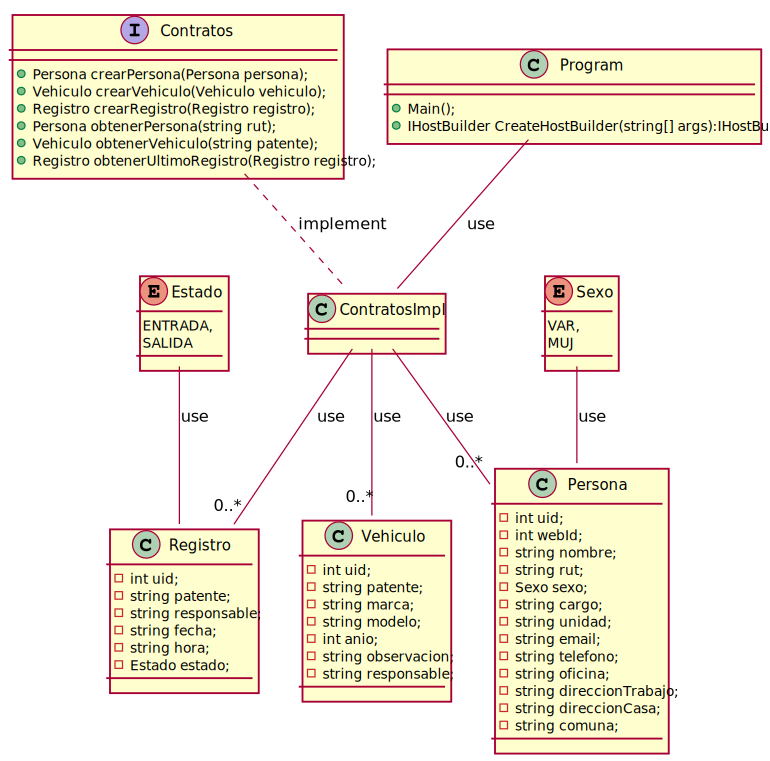

# Server ParkingUCN

Server del proyecto ParkingUCN para el curso de Desarrollo e Integración De Soluciones, UCN.

## Techologies
[.NET Core 3.1](https://dotnet.microsoft.com/)
    
## .NET Libraries

* [Microsoft.EntityFrameworkCore](https://www.nuget.org/packages/Microsoft.EntityFrameworkCore/)
* [Microsoft.EntityFrameworkCore.Sqlite](https://www.nuget.org/packages/Microsoft.EntityFrameworkCore.Sqlite/)
* [Microsoft.Extensions.Hosting](https://www.nuget.org/packages/Microsoft.Extensions.Hosting/)
* [Microsoft.Extensions.DependencyInjection](https://www.nuget.org/packages/Microsoft.Extensions.DependencyInjection/)
* [Microsoft.Extensions.Logging](https://www.nuget.org/packages/Microsoft.Extensions.Logging/)
* [Microsoft.Extensions.Logging.Console](https://www.nuget.org/packages/Microsoft.Extensions.Logging.Console/)
* [zeroc.ice.net](https://www.nuget.org/packages/zeroc.ice.net/)
* [zeroc.icebuilder.msbuild](https://www.nuget.org/packages/zeroc.icebuilder.msbuild/)

## Authors  
[Jorge Pizarro](https://github.com/JorgePT93/) -      <jorge.pizarro93@gmail.com>

[Charlie Condorcet](https://github.com/CharlieCondorcet) -      <ccm059@alumnos.ucn.cl>

[Pablo Castillo](https://github.com/Pablo-Castillo) -      <pablo.castillo01@alumnos.ucn.cl>

## UML - Diagrama de Clases

--- 

<!--
@startuml
interface Contratos{
+Persona crearPersona(Persona persona);
+Vehiculo crearVehiculo(Vehiculo vehiculo);
+Registro crearRegistro(Registro registro);
+Persona obtenerPersona(string rut);
+Vehiculo obtenerVehiculo(string patente);
+Registro obtenerUltimoRegistro(Registro registro);
}
class Registro {
- int uid;
- string patente;
- string responsable;
- string fecha;
- string hora;
- Estado estado;
}
class Vehiculo{ 
-int uid;
-string patente;
-string marca;
-string modelo;
-int anio;
-string observacion;
-string responsable;
}
enum Sexo{
VAR,
MUJ
}
enum Estado{
ENTRADA,
SALIDA
}
class Persona{
- int uid;
- int webId;
- string nombre; 
- string rut; 
- Sexo sexo; 
- string cargo;
- string unidad;
- string email; 
- string telefono; 
- string oficina; 
- string direccionTrabajo;
- string direccionCasa;
- string comuna;
}
class ContratosImpl{
}
class Program{
+Main();
+IHostBuilder CreateHostBuilder(string[] args):IHostBuilder
}
Program--ContratosImpl: use
ContratosImpl--"0..*"Persona:use
ContratosImpl--"0..*"Vehiculo:use
ContratosImpl--"0..*"Registro:use
Contratos..ContratosImpl:implement
Sexo--Persona:use
Estado-- Registro:use
@enduml
-->
